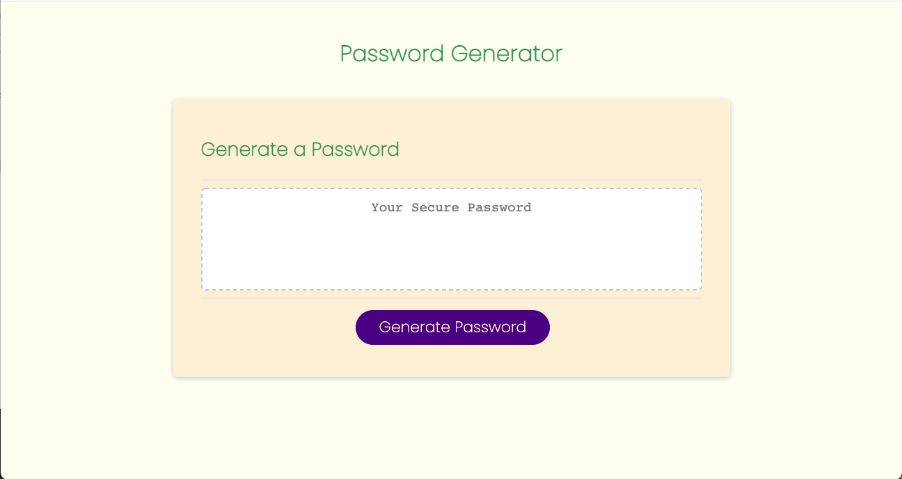
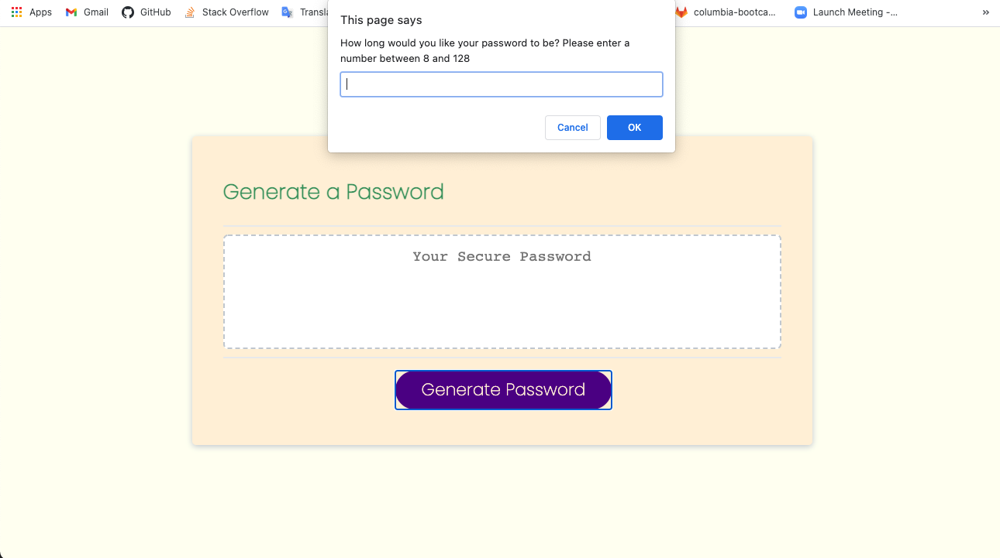
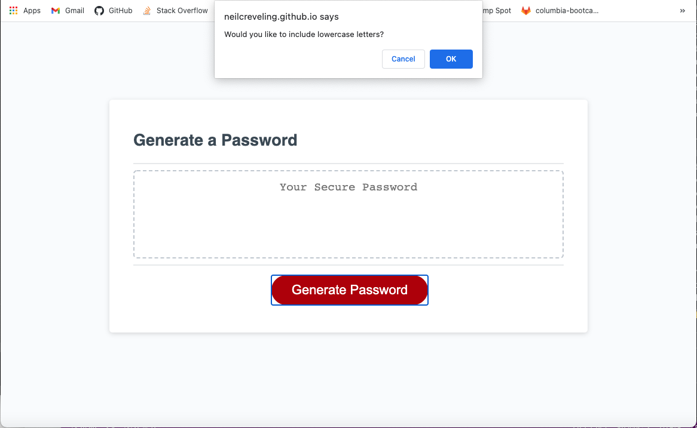
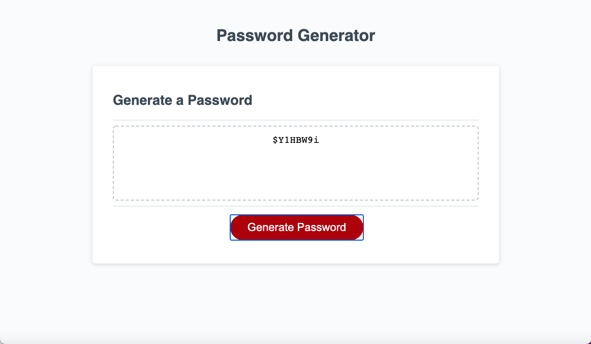

# Random-Password-Generator
Generates a random password based on chosen criteria.

## About

When users have access to sensitive data, strong passwords are essential for optimal security. This application creates strong passwords by randomly generating a password that meets certain criteria. These criteria are chosen by the user, giving them control - to a degree - over the final generated password.

## Application

Upon opening the link, the user is presented with a text box with placeholder text and a button labeled "Generate Password".

When the "Generate Password" Button is pressed, the user will be prompted to choose a number between 8 and 128. This number will be the length of the final generated password. If the user chooses a number that does not meet these requirements, they will be asked whether they would like to try again or not.

After the number is submitted, the user will be asked to confirm which types of characters they would like to include in the generated password: lowercase letters, uppercase letters, numbers, and/or special characters. This option allows the user to customize which types of characters they would like to include, from only one type to all of the available types.

Once all prompts have been submitted, the final generated password will be displayed in the textbox.

## License

MIT License

Copyright (c) 2021 Neil Creveling

Permission is hereby granted, free of charge, to any person obtaining a copy of this software and associated documentation files (the "Software"), to deal in the Software without restriction, including without limitation the rights to use, copy, modify, merge, publish, distribute, sublicense, and/or sell copies of the Software, and to permit persons to whom the Software is furnished to do so, subject to the following conditions:

The above copyright notice and this permission notice shall be included in all copies or substantial portions of the Software.

THE SOFTWARE IS PROVIDED "AS IS", WITHOUT WARRANTY OF ANY KIND, EXPRESS OR IMPLIED, INCLUDING BUT NOT LIMITED TO THE WARRANTIES OF MERCHANTABILITY, FITNESS FOR A PARTICULAR PURPOSE AND NONINFRINGEMENT. IN NO EVENT SHALL THE AUTHORS OR COPYRIGHT HOLDERS BE LIABLE FOR ANY CLAIM, DAMAGES OR OTHER LIABILITY, WHETHER IN AN ACTION OF CONTRACT, TORT OR OTHERWISE, ARISING FROM, OUT OF OR IN CONNECTION WITH THE SOFTWARE OR THE USE OR OTHER DEALINGS IN THE SOFTWARE.
